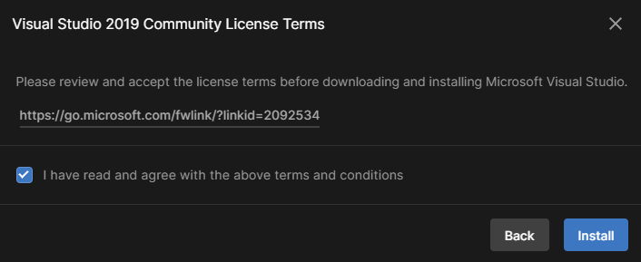

## Unity وVisual Studio

العديد من محرّرات الأكواد يمكن أن تستخدم مع Unity، لكن Visual Studio Community Edition هو على الأرجح الأسهل في التثبيت والاستخدام.

في Unity Hub، اختر **Installs** من القائمة على اليسار، ثمّ انقر على أيقونة الترس الموجود على يمين إصدار الـUnity الخاص بك، ثمّ اختر **Add modules**.

تأكّد من أنّ مربّع الاختيار الموجود بجوار Microsoft Visual Studio Community قد تمّ تحديده، ثمّ انقر على زرّ **Continue**.

اقرأ شروط الترخيص، ثمّ إذا وافقت، حدّد على المربّع وانقر على زرّ **Install**.

بمجرّد اكتمال تثبيت Visual Studio، ستحتاج إلى **إعادة تشغيل حاسوبك**، ثمّ افتح مشروع Unity الخاصّ بك. انقر على **تعديل**، ثمّ اختر **Preferences** من القائمة.

من القائمة على اليسار، اختر **External Tools** وفي القائمة المسندلة لـ**External Script Editor** اختر **Visual Studio 2019**.

