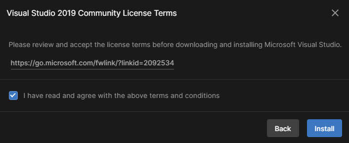
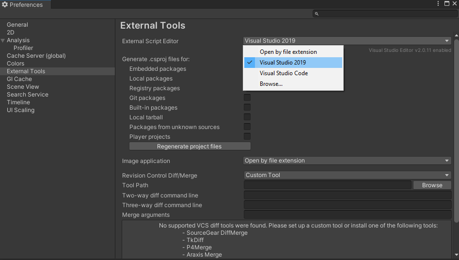

## Unity και Visual Studio

Πολλοί διαφορετικοί επεξεργαστές κώδικα μπορούν να χρησιμοποιηθούν με το Unity, αλλά το Visual Studio Community Edition είναι ίσως το πιο εύκολο στην εγκατάσταση και χρήση.

Στο Unity Hub, επίλεξε **Installs** από το μενού στα αριστερά και, στη συνέχεια, κάνε κλικ στο εικονίδιο με το γρανάζι στα δεξιά της έκδοσης του Unity και επίλεξε **Add modules**.

Βεβαιωθείτε ότι το πλαίσιο ελέγχου δίπλα στην Κοινότητα του Microsoft Visual Studio έχει επιλεγεί και, στη συνέχεια, κάντε κλικ στο κουμπί **Continue**.

Διάβασε τους όρους άδειας χρήσης και στη συνέχεια εάν συμφωνείς, επίλεξε το πλαίσιο και κάνε κλικ στο κουμπί **Install**.

Μόλις ολοκληρωθεί η εγκατάσταση του Visual Studio, θα χρειαστεί να **κάνεις επανεκκίνηση του υπολογιστή**και μετά να ανοίξεις το έργο Unity. Κάνε κλικ στο **Edit** και, στη συνέχεια, επίλεξε **Preferences** από το μενού.

Στο μενού στα αριστερά, επίλεξε **External Tools** και στο αναπτυσσόμενο μενού για **External Script Editor** επίλεξε **Visual Studio 2019**.

