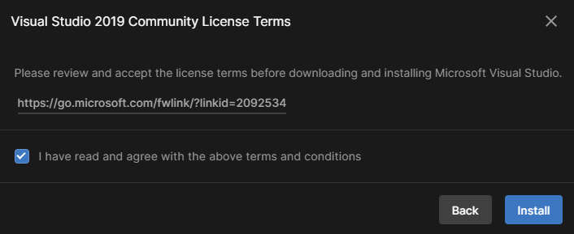

## Unity and Visual Studio

Many different code editors can be used with Unity, but Visual Studio Community Edition is probably the easiest to install and use.

In Unity Hub, select **Installs** from the menu on the left, and then click on the gear icon to the right of your Unity version and select **Add modules**.

Make sure the checkbox next to Microsoft Visual Studio Community has been checked, and then click the **Continue** button.

Read the licensing terms and then if you agree, check the box and click the **Install** button.

Once the installation of Visual Studio has completed you will need to **restart your computer**, then open your Unity project. Click on **Edit** and then choose **Preferences** from the menu.

In the menu on the left, select **External Tools** and in the drop-down menu for **External Script Editor** choose **Visual Studio 2019**.

