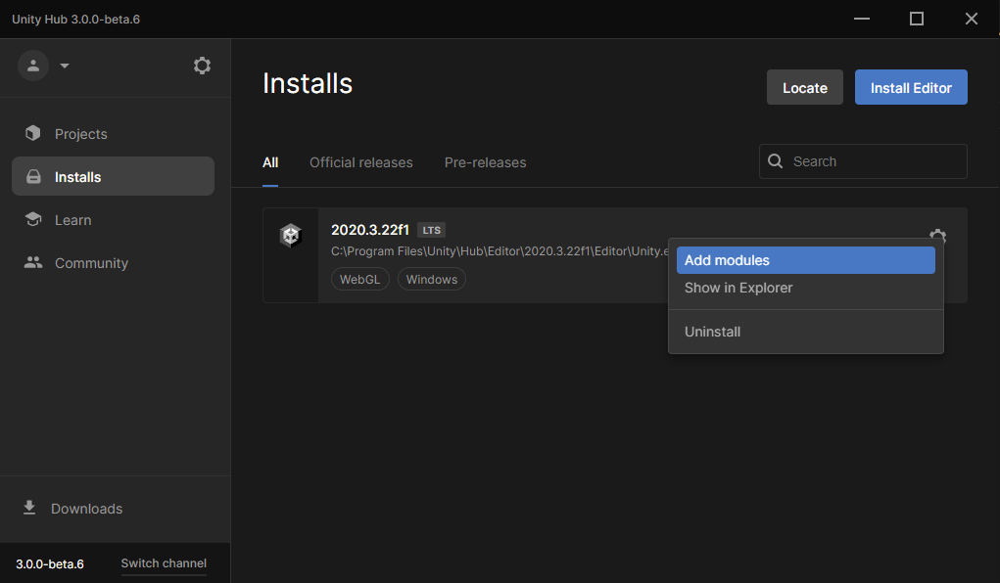

## Unity y Visual Studio

Se pueden usar muchos editores de texto diferentes con Unity, pero Visual Studio Community Edition es probablemente el más fácil de instalar y usar.

En Unity Hub, selecciona **Installs** en el menú de la izquierda y luego haz clic en el ícono de ajustes a la derecha de tu versión de Unity y selecciona **Add modules**.

Asegúrate de que la casilla de verificación junto a Microsoft Visual Studio Community esté marcada y luego haz clic en el botón **Continue**.

Lee los términos de la licencia y luego, si estás de acuerdo, marca la casilla y haz clic en el botón **Install**.

Una vez que se haya completado la instalación de Visual Studio, deberás **reiniciar tu computadora**y luego abrir tu proyecto de Unity (Unity project). Haz clic en **Edit** y luego elige **Preferences** del menú.

En el menú de la izquierda, selecciona</strong></strong> **External Tools** y en el menú desplegable para **External Script Editor</0> elige **Visual Studio 2019</0>.

