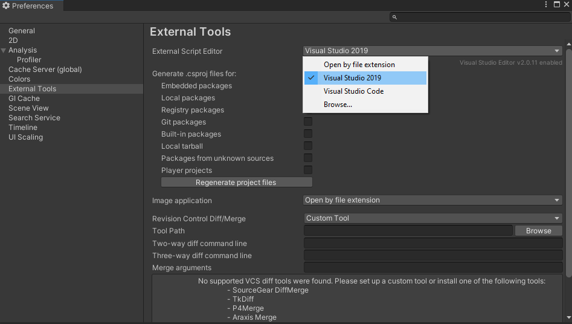

## Unity et Visual Studio

De nombreux éditeurs de code différents peuvent être utilisés avec Unity, mais Visual Studio Community Edition est probablement le plus facile à installer et à utiliser.

Dans Unity Hub, sélectionne **Installs** dans le menu de gauche, puis clique sur l'icône d'engrenage à droite de ta version Unity et sélectionne **Add modules**.

Assure-toi que la case à côté de Microsoft Visual Studio Community a été cochée, puis clique sur le bouton **Continue**.

Lis les termes de la licence puis, si tu es d'accord, coche la case et clique sur le bouton **Install**.

Une fois l'installation de Visual Studio terminée, tu devras **redémarrer ton ordinateur**, puis ouvrir ton projet Unity. Clique sur **Edit** puis choisis **Preferences** dans le menu.

Dans le menu de gauche, sélectionne **External Tools** et dans le menu déroulant pour **External Script Editor** choisis **Visual Studio Community 2019**.

