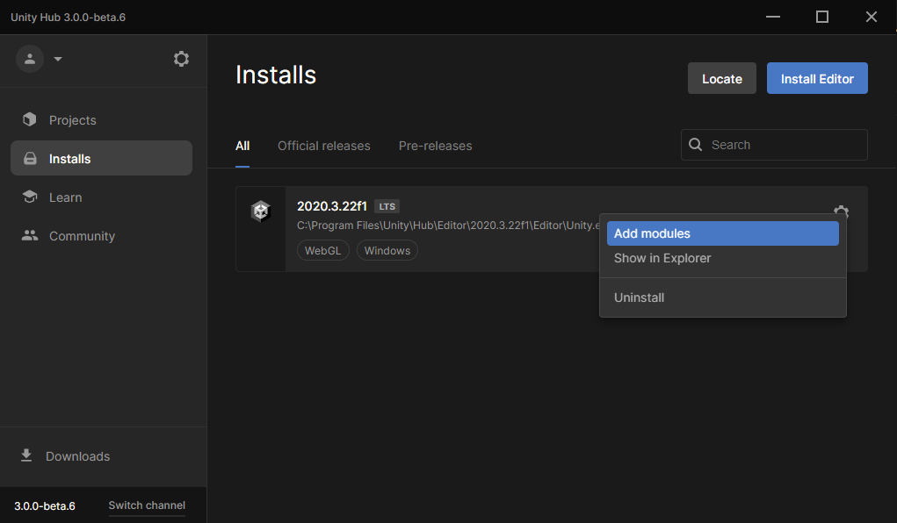

## Unity en Visual Studio

Ja kan verschillende code-editors gebruiken met Unity, maar Visual Studio Community Edition is het makkelijkst te installeren en te gebruiken.

Selecteer in Unity Hub **installs** in het menu aan de linkerkant, en klik vervolgens op het tandwielpictogram rechts van de Unity-versie en selecteer **Add modules**.

Zorg ervoor dat het selectievakje naast Microsoft Visual Studio Community is ingeschakeld en klik vervolgens op de knop **Continue**.

Lees de licentievoorwaarden en vink het selectievakje aan als je akkoord gaat en klik op de knop **Install**.

Zodra de installatie van Visual Studio is voltooid, moet je de computer **opnieuw opstarten** en vervolgens je Unity-project openen. Klik op **Edit** en kies vervolgens **Preferences** in het menu.

Selecteer in het menu aan de linkerkant **External Tools** en kies in het vervolgkeuzemenu voor **External Script Editor** **Visual Studio Community 2019**.

